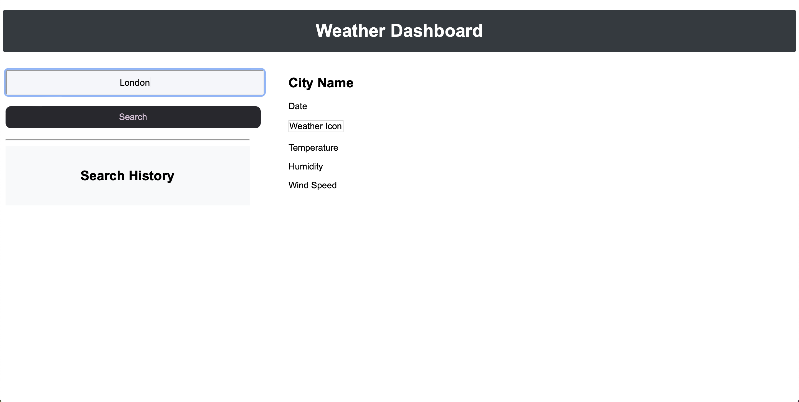
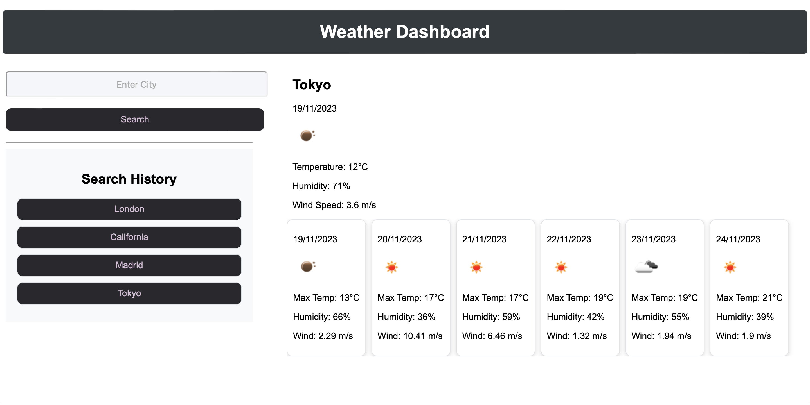

# fiveDay-weather-app

## Description

This is a simple weather app that displays the current and forecast for 5 days. The user can search by city/country name it uses OpenWeatherMap API to fetch data.
Features are:

Weather dashboard with form input.

When a user searches for a city they are presented with current and future conditions for that city and that city is added to the search history.

When a user views the current weather conditions for that city they are presented with:

The city name/The date/An icon representation of weather conditions/The temperature/The humidity/The wind speed

When a user views future weather conditions for that city they are presented with a 5-day forecast that displays:

The date/An icon representation of weather conditions/The temperature/The humidity

When a user clicks on a city in the search history they are again presented with current and future conditions for that city.

I published the project with an API key that will be active until 24/11/23.
After this date I will revoke the API key.

Bellow you can see the images of deployed application together with links where you can access it.

Here is the screenshot of deployed application:

Deployed application: https://janeks111.github.io/fiveDay-weather-app/

Repository: https://github.com/Janeks111/fiveDay-weather-app

## Installation

N/A

## Usage

Fell free to use this for your personal needs.

## Credits

N/A

## License

Please refer to the LICENSE in the repo.
